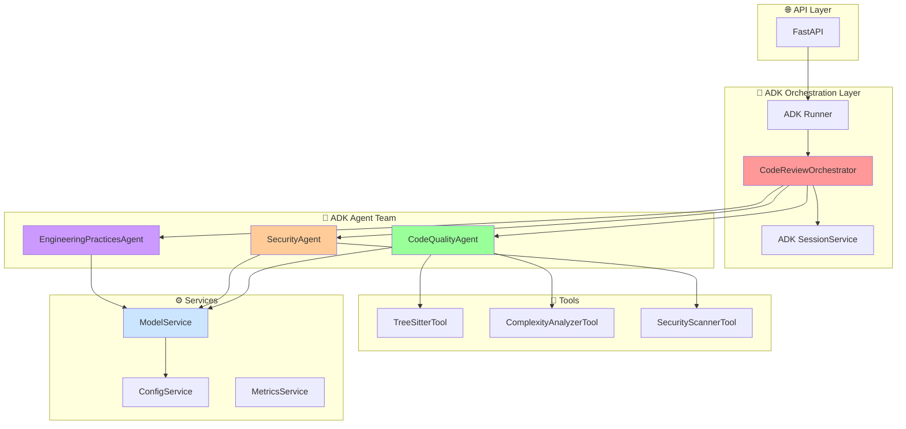

# ADK Multi-Agent Code Review System - Architecture Design

**Version:** 3.0 (Google ADK Compliant)
**Date:** November 6, 2025
**Architecture:** Google ADK-Based Multi-Agent Code Review System

---

## Table of Contents

1. [Executive Summary](#executive-summary)
2. [Google ADK Architecture Overview](#google-adk-architecture-overview)
3. [ADK Component Architecture](#adk-component-architecture)
4. [Specialized Agents (Analysis)](#specialized-agents-analysis)
5. [Orchestrator Agent (Workflow)](#orchestrator-agent-workflow)
6. [Tools (Functions)](#tools-functions)
7. [Services (Infrastructure)](#services-infrastructure)
8. [Repository Structure](#repository-structure)
9. [Configuration](#configuration)
10. [API Integration](#api-integration)
11. [Implementation Strategy](#implementation-strategy)


ADK Reference Documentation: https://google.github.io/adk-docs/tutorials/agent-team/

---

## Executive Summary

This document outlines a Google ADK-compliant architecture for an AI-powered code review system. It follows the "Agent Team" pattern described in the ADK documentation, where a root agent orchestrates a team of specialized agents to accomplish a complex task.

### Key Architectural Principles

*   **🎯 Orchestrator Agent:** A root agent that manages the code review workflow, delegating tasks to specialized agents.
*   **🤖 Specialized Agents:** A team of agents, each responsible for a specific analysis domain (e.g., code quality, security).
*   **🔧 Tools:** Simple, reusable functions that agents use to interact with the codebase and perform specific checks.
*   **State Management:** ADK's Session State is used to maintain context and share information between agents.
*   **🔌 Flexible LLM Backend:** A pluggable architecture to support multiple LLM providers, including local models like Ollama for development and powerful models like Google Gemini for production, managed through a centralized configuration.

### Google ADK Component Hierarchy

```
📦 ai-code-review-multi-agent/
├── 🎯 code_review_orchestrator/
│   ├── agent.py
│   └── 📁 sub_agents/
│       ├── code_quality_agent/
│       └── security_agent/
├── ⚙️ services/
├── 🔧 tools/
├── 📦 core/
└── 📊 observability/
```

---

## Google ADK Architecture Overview

### ADK Pattern: Agent Team

Our architecture implements the "Agent Team" pattern, where a root agent (the "Orchestrator") manages a team of specialized agents.

#### 1. Specialized Agents (The Team)

These agents are instances of `LlmAgent` and are responsible for a single analysis domain. They use tools to perform their analysis and respond to the orchestrator.

```python
# Example: CodeQualityAgent
from google.adk.agents import LlmAgent

code_quality_agent = LlmAgent(
    name="CodeQualityAgent",
    instruction="Analyze the code for quality issues using the available tools.",
    tools=[TreeSitterTool(), ComplexityAnalyzerTool()],
)
```

#### 2. Orchestrator Agent (The Team Lead)

The orchestrator is a custom agent that extends `BaseAgent`. It receives the initial code review request and delegates the analysis to the appropriate specialized agents. It then synthesizes the results into a final report.

```python
# Example: CodeReviewOrchestrator
from google.adk.core import BaseAgent, Event
from google.adk.session import InvocationContext

class CodeReviewOrchestrator(BaseAgent):
    async def _run_async_impl(self, ctx: InvocationContext) -> AsyncGenerator[Event, None]:
        # 1. Delegate to CodeQualityAgent
        # 2. Delegate to SecurityAgent
        # 3. Synthesize results
        ...
```

#### 3. Tools (Simple Functions)

Tools are simple Python functions or classes that perform a single, well-defined task. They are used by the specialized agents to analyze the code.

```python
# Example: ComplexityAnalyzerTool
class ComplexityAnalyzerTool:
    def __call__(self, code: str) -> dict:
        # ... analyze complexity ...
        return {"cyclomatic_complexity": 10}
```

#### 4. Session State (Memory)

The `InvocationContext` (`ctx`) provides access to the `Session`, which holds the state for the current code review. This allows agents to share information. For example, the `CodeReviewOrchestrator` can pass the file path to the specialized agents, and they can in turn store their results in the session state for the orchestrator to access.

```python
# Storing data in session state
ctx.session.state["quality_analysis"] = {"score": 95}

# Retrieving data from session state
quality_analysis = ctx.session.state.get("quality_analysis")
```

---

## ADK Component Architecture

### High-Level Architecture Diagram



### Architecture Benefits

*   **✅ ADK Compliance:** Follows the "Agent Team" pattern from the official Google ADK documentation.
*   **✅ Clean Separation:** Clear distinction between the orchestrator, specialized agents, tools, and services.
*   **✅ Maintainable:** Each component has a single, well-defined responsibility.
*   **✅ Testable:** Components can be tested independently.
*   **✅ Extensible:** Easy to add new specialized agents or tools to the team.

---

## Specialized Agents (Analysis)

### CodeQualityAgent

This agent is responsible for analyzing the code for quality issues. It uses tools like `TreeSitterTool` and `ComplexityAnalyzerTool` to inspect the code's structure and complexity.

```python
from google.adk.agents import LlmAgent
from tools import TreeSitterTool, ComplexityAnalyzerTool

code_quality_agent = LlmAgent(
    name="CodeQualityAgent",
    instruction="Analyze the provided code for quality issues, focusing on maintainability, readability, and best practices. Use the available tools to inspect the code.",
    tools=[TreeSitterTool(), ComplexityAnalyzerTool()],
    output_key="code_quality_result",
)
```

### SecurityAgent

This agent is responsible for analyzing the code for security vulnerabilities. It uses tools like `SecurityScannerTool` to detect common security issues.

```python
from google.adk.agents import LlmAgent
from tools import SecurityScannerTool

security_agent = LlmAgent(
    name="SecurityAgent",
    instruction="Analyze the provided code for security vulnerabilities. Use the available tools to scan for issues like injection flaws, broken authentication, and sensitive data exposure.",
    tools=[SecurityScannerTool()],
    output_key="security_result",
)
```

### EngineeringPracticesAgent

This agent is responsible for analyzing the code for adherence to engineering best practices, such as documentation, testing, and CI/CD configurations.

```python
from google.adk.agents import LlmAgent
from tools import TestCoverageTool, DocumentationTool

engineering_practices_agent = LlmAgent(
    name="EngineeringPracticesAgent",
    instruction="Analyze the code for adherence to engineering best practices. Use the available tools to check for test coverage, documentation quality, and CI/CD configuration.",
    tools=[TestCoverageTool(), DocumentationTool()],
    output_key="engineering_practices_result",
)
```

---

## Orchestrator Agent (Workflow)


### CodeReviewOrchestrator


The `CodeReviewOrchestrator` is the root agent of our agent team. It is responsible for receiving the initial code review request and delegating the analysis to the appropriate specialized sub-agents.


`code_review_orchestrator/agent.py`

```python

from google.adk.agents import LlmAgent

from google.adk.core import BaseAgent, Event

from google.adk.session import InvocationContext

from typing import AsyncGenerator


# Import the sub-agents

from .sub_agents.code_quality_agent.agent import agent as code_quality_agent

from .sub_agents.security_agent.agent import agent as security_agent


class CodeReviewOrchestrator(BaseAgent):

    async def _run_async_impl(self, ctx: InvocationContext) -> AsyncGenerator[Event, None]:

        """Orchestrates the code review process."""

        # 1. Delegate to sub-agents

        # The ADK will automatically delegate to the correct sub-agent based on the instruction

        yield


# Define the root agent

agent = CodeReviewOrchestrator(

    sub_agents=[

        code_quality_agent,

        security_agent,

    ]

)

```
---

## Tools (Functions)

Tools are simple Python classes or functions that perform specific, isolated tasks. They are designed to be used by the specialized agents to analyze the code.


### TreeSitterTool

This tool uses the `tree-sitter` library to parse the code and extract information about its structure.

```python

class TreeSitterTool:

    def __call__(self, code: str, language: str) -> dict:

        # ... parse code and extract AST ...

        return {"ast": { ... }}

```


### ComplexityAnalyzerTool


This tool analyzes the code for complexity metrics, such as cyclomatic complexity.


```python

class ComplexityAnalyzerTool:

    def __call__(self, code: str) -> dict:

        # ... analyze complexity ...

        return {"cyclomatic_complexity": 10}

```

### SecurityScannerTool


This tool scans the code for common security vulnerabilities.


```python

class SecurityScannerTool:

    def __call__(self, code: str) -> dict:

        # ... scan for vulnerabilities ...

        return {"vulnerabilities": []}

```

---


## Services (Infrastructure)

Services are responsible for handling cross-cutting concerns, such as configuration, model management, and metrics.

### ConfigurationService

This service is responsible for loading and providing configuration to the rest of the application from YAML files located in the `config/` directory. It centralizes configuration management, making it easy to switch between environments.

```python
# src/utils/config_loader.py
class ConfigurationService:
    def load_config(self) -> dict:
        # ... load config from YAML files ...
        return {"llm": {"provider": "ollama"}}

    def get_llm_config(self) -> dict:
        # ... returns the 'llm' section of the config ...
```

### ModelService

The `ModelService` is a crucial component that abstracts the interaction with different LLM providers. It allows the agents to request a model without needing to know the specific implementation details of the provider.

**Responsibilities:**

*   Loads LLM provider configurations (e.g., Ollama, Google Gemini) from `config/llm/models.yaml`.
*   Provides a unified interface for making requests to LLM models.
*   Selects the appropriate model based on the current environment (e.g., Ollama for development, Gemini for production) as defined in the configuration.

```python
# src/services/model_service.py
class ModelService:
    def __init__(self, config_service: ConfigurationService):
        self.config = config_service.get_llm_config()
        self.provider_name = self.config.get("default_provider")
        # ... initialize the correct client (Ollama, Gemini, etc.)

    def get_model(self, model_name: str):
        # ... returns a model instance ...

    async def execute_request(self, model, prompt: str) -> str:
        # ... executes the request using the configured provider ...
```

### MetricsService

This service is responsible for collecting and exposing metrics about the application's performance.

```python
class MetricsService:
    def record_agent_execution(self, agent_name: str, duration: float):
        # ... record metrics ...
        pass
```

---

## Repository Structure

To align with Google ADK's file-based agent discovery and the "Agent Team" pattern, the repository is structured with a clear hierarchy. The orchestrator acts as the root agent, and the specialized agents are its sub-agents.

```
ai-code-review-multi-agent/
├── 📁 code_review_orchestrator/      # The root agent (orchestrator)
│   ├── 📄 agent.py                  # Orchestrator agent definition
│   ├── 📄 __init__.py
│   └── 📁 sub_agents/
│       ├── 📁 code_quality_agent/
│       │   ├── 📄 agent.py
│       │   └── 📄 __init__.py
│       └── 📁 security_agent/
│           ├── 📄 agent.py
│           └── 📄 __init__.py
├── 📁 core/
│   ├── 📄 session.py
│   ├── 📄 callbacks.py
│   └── 📄 correlation.py
├── 📁 observability/
│   ├── 📄 logging.py
│   ├── 📄 metrics.py
│   └── 📄 tracing.py
├── 📁 schemas/
│   └── 📄 output_models.py
├── 📁 services/
│   ├── 📄 model_service.py
│   └── 📄 config_service.py
├── 📁 tools/
│   ├── 📄 complexity_analyzer.py
│   └── 📄 security_scanner.py
├── 📁 config/
│   └── ...
├── 📁 outputs/
├── 📄 pyproject.toml
└── 📄 README.md
```

### Key Components Explained

*   **`code_review_orchestrator/`**: This is the root agent directory. The ADK's file-based discovery will identify this as the main entry point for the agent team.
    *   `agent.py`: Defines the `CodeReviewOrchestrator` agent and lists its sub-agents.
    *   `sub_agents/`: This directory contains the specialized agents that the orchestrator delegates tasks to. This hierarchical structure is a core concept in the ADK's "Agent Team" pattern.

*   **`core/`**: Contains the core building blocks of the agent system, separate from the agent-specific logic.
    *   `session.py`: Manages session and state.
    *   `callbacks.py`: Implements the callback system for guardrails and output validation.
    *   `correlation.py`: Manages correlation IDs for tracing.

*   **`observability/`**, **`schemas/`**, **`services/`**, **`tools/`**: These directories contain shared, non-agent-specific code, following good software engineering practices. They provide functionalities that can be used by any agent or service in the system.

*   **`config/`**: Centralized YAML configuration for the entire application.

*   **`outputs/`**: Stores the JSON reports and other artifacts from agent runs.

This structure is a hybrid approach that respects the ADK's file-based agent discovery while maintaining a clean separation of concerns for non-agent code, which is crucial for a production-grade system.

The system uses a centralized, YAML-based configuration system located in the `config/` directory. This approach allows for a clean separation of configuration from code and makes it easy to manage different environments.

### LLM Configuration

`config/llm/models.yaml` defines the available LLM providers and their models.

```yaml
# config/llm/models.yaml
default_provider: "ollama"

providers:
  ollama:
    base_url: "http://host.docker.internal:11434"
    models:
      llama3_1_8b:
        name: "llama3.1:8b"
        max_tokens: 8192
  google_gemini:
    api_key: "${GEMINI_API_KEY}"
    models:
      gemini-pro:
        name: "gemini-pro"
        max_tokens: 8192
```

### Environment-Specific Configuration

Environment-specific files are used to override the default settings. For example, you can set the default provider to Ollama for development and Gemini for production.

`config/environments/development.yaml`:
```yaml
# Use Ollama for local development
llm:
  default_provider: "ollama"
```

`config/environments/production.yaml`:
```yaml
# Use Gemini in production
llm:
  default_provider: "google_gemini"
```

---

## API Integration

With the file-based agent structure, the ADK's built-in web server can be used to expose the agent team as an API.

To start the API, you would run the following command from the root of the project:

```bash
adk web
```

The ADK will automatically discover the `code_review_orchestrator` as the root agent and expose it as an API endpoint. You can then send requests to `http://localhost:8000/code_review_orchestrator/run` to initiate a code review.

---

## Implementation Strategy

### Phase 1: Core ADK and Services Implementation

*   **Goal:** Implement the core ADK architecture and essential services.
*   **Tasks:**
    1.  Implement the `CodeReviewOrchestrator` root agent.
    2.  Implement the specialized sub-agents (`CodeQualityAgent`, `SecurityAgent`).
    3.  **Implement the `ConfigurationService` to load YAML configs.**
    4.  **Implement the `ModelService` with clients for Ollama (for development) and Google Gemini (for production).**
    5.  Set up the ADK web server.

### Phase 2: Tool and Agent Enhancement

*   **Goal:** Enhance the capabilities of the agents and tools.
*   **Tasks:**
    1.  Implement the `EngineeringPracticesAgent`.
    2.  Add more tools for security, documentation, and test coverage analysis.
    3.  Refine the prompts and instructions for the specialized agents.

### Phase 3: Production Readiness

*   **Goal:** Prepare the system for production use.
*   **Tasks:**
    1.  Implement the `MetricsService`.
    2.  **Configure the production environment to use Google Gemini.**
    3.  Add comprehensive logging and error handling.
    4.  Write unit and integration tests.


---


## Conclusion


This document outlines a clear and maintainable architecture for a multi-agent code review system based on the Google ADK. By following the file-based agent team pattern, we can build a system that is modular, extensible, and easy to understand. The separation of concerns between the orchestrator, specialized agents, and tools will allow us to develop and maintain the system effectively.
