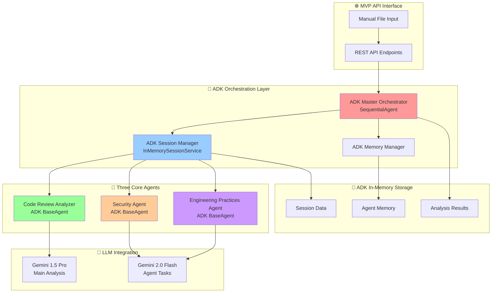

# ADK Multi-Agent Code Review System - MVP Design

**Version:** MVP 1.0  
**Date:** October 14, 2025  
**Architecture:** ADK-Based Multi-Agent Code Review MVP for Proof of Value

---

## Table of Contents

1. [MVP Executive Summary](#mvp-executive-summary)
2. [MVP System Architecture](#mvp-system-architecture)
3. [ADK Orchestration Layer](#adk-orchestration-layer)
4. [Three Core Specialized Agents](#three-core-specialized-agents)
5. [ADK Session & Memory Management](#adk-session--memory-management)
6. [LLM Integration](#llm-integration)
7. [Configuration Management](#configuration-management)
8. [API Endpoints](#api-endpoints)
9. [MVP Repository Structure](#mvp-repository-structure)
10. [Deployment & Setup](#deployment--setup)

---

## MVP Executive Summary

The **ADK Multi-Agent Code Review MVP** is a streamlined proof-of-value system that demonstrates the core capabilities of AI-powered code review using Google's Agent Development Kit (ADK). This MVP focuses on essential functionality with three specialized agents for immediate value delivery.

### MVP Scope & Objectives

**🎯 Primary Goal:** Demonstrate practical AI code review capabilities using ADK patterns
**📊 Success Metrics:** Generate actionable code review reports with recommendations
**⚡ Time to Value:** Functional system within days, not weeks

### MVP Key Features

**1. Three Core Analysis Agents**
- **Code Review Analyzer**: Code quality, complexity, and maintainability analysis
- **Security Agent**: Security vulnerabilities and best practices validation
- **Engineering Best Practices Agent**: DevOps practices, testing, and code standards

**2. ADK-Native Architecture**
- Google ADK BaseAgent implementation for all agents
- ADK InMemorySessionService for session management
- ADK workflow patterns for orchestration
- Real LLM integration (Gemini models)

**3. Manual File Input & Report Generation**
- Direct code file input via API
- Comprehensive analysis reports with recommendations
- Structured JSON and human-readable output formats

### MVP Exclusions (For Full Version)

- ❌ Redis/Neo4j external dependencies
- ❌ Complex learning/knowledge graph features
- ❌ Advanced workflow orchestration
- ❌ Production-grade scaling features
- ❌ Complex CI/CD integrations

---

## MVP System Architecture

### High-Level MVP Architecture



### MVP Component Overview

**🎯 Simplified Architecture Benefits:**
- **Fast Development**: No external database setup required
- **Easy Testing**: Self-contained system with in-memory storage
- **Quick Deployment**: Single container deployment
- **Proof of Value**: Focus on core AI analysis capabilities

---

## ADK-Compliant Repository Structure

The MVP follows the exact same ADK repository structure as the full-scale design, implementing only the essential components for the three core agents while maintaining the complete architectural foundation for future expansion.

```
ai-code-review-multi-agent/
├── 📁 src/
│   ├── 📁 core/
│   │   ├── 📄 __init__.py
│   │   ├── 📄 exceptions.py           # Custom exceptions for orchestration
│   │   ├── 📄 config.py              # Configuration management
│   │   ├── 📄 constants.py           # System constants and enums
│   │   └── 📄 types.py               # Common type definitions
│   │
│   ├── 📁 agents/
│   │   ├── 📄 __init__.py
│   │   ├── 📄 base_agent.py          # ADK BaseAgent extension with common functionality
│   │   ├── � specialized/
│   │   │   ├── �📄 __init__.py
│   │   │   ├── 📄 code_quality_agent.py      # MVP: Code quality analysis (extends BaseAgent)
│   │   │   ├── 📄 security_agent.py          # MVP: Security standards analysis (extends BaseAgent)
│   │   │   └── 📄 engineering_practices_agent.py # MVP: DevOps and practices (extends BaseAgent)
│   │   │   # Note: Other agents (architecture, performance, etc.) will be added in future phases
│   │   │
│   │   └── 📁 custom/
│   │       ├── 📄 __init__.py
│   │       ├── 📄 plugin_framework.py        # Custom agent plugin system
│   │       └── 📄 agent_registry.py          # Dynamic agent discovery
│   │
│   ├── 📁 tools/
│   │   ├── 📄 __init__.py
│   │   # MVP: Basic tools for the three core agents
│   │   ├── 📄 tree_sitter_tool.py        # ADK FunctionTool for code parsing
│   │   ├── � complexity_analyzer_tool.py # ADK FunctionTool for complexity metrics
│   │   └── 📄 static_analyzer_tool.py     # ADK FunctionTool for static analysis
│   │   # Note: Additional tools (github, gitlab, etc.) will be added in future phases
│   │
│   ├── 📁 workflows/
│   │   ├── 📄 __init__.py
│   │   ├── 📄 master_orchestrator.py         # Main orchestrator using ADK workflow patterns
│   │   └── 📄 sequential_analysis_workflow.py # ADK SequentialAgent for ordered analysis
│   │   # Note: Parallel and loop workflows will be added in future phases
│   │
│   ├── 📁 services/
│   │   ├── 📄 __init__.py
│   │   ├── 📄 session_service.py     # ADK InMemorySessionService (in-memory for MVP)
│   │   ├── 📄 memory_service.py      # Memory management service using ADK patterns
│   │   └── 📄 model_service.py       # ADK Model Garden integration service
│   │   # Note: learning_service.py will be added when Neo4j integration is implemented
│   │
│   ├── 📁 adapters/
│   │   ├── 📄 __init__.py
│   │   # MVP: Placeholder for future external service adapters
│   │   # redis_adapter.py, neo4j_adapter.py will be added in future phases
│   │
│   ├── 📁 models/
│   │   ├── 📄 __init__.py
│   │   ├── 📄 analysis_models.py     # Analysis request/response models
│   │   ├── 📄 session_models.py      # Session-related data models
│   │   ├── 📄 agent_models.py        # Agent configuration models
│   │   ├── 📄 workflow_models.py     # ADK workflow configuration models
│   │   ├── 📄 tool_models.py         # ADK FunctionTool configuration models
│   │   └── 📄 report_models.py       # Report generation models
│   │   # Note: learning_models.py will be added when Neo4j integration is implemented
│   │
│   ├── � utils/
│   │   ├── �📄 __init__.py
│   │   ├── 📄 logging.py             # Centralized logging configuration
│   │   ├── 📄 monitoring.py          # Performance monitoring utilities
│   │   ├── 📄 security.py            # Security utilities (PII detection, etc.)
│   │   ├── 📄 validation.py          # Input validation and sanitization
│   │   └── 📄 adk_helpers.py         # ADK-specific utility functions
│   │
│   ├── 📁 api/
│   │   ├── 📄 __init__.py
│   │   ├── 📄 main.py                # FastAPI application and ADK integration
│   │   ├── 📄 dependencies.py        # API dependency injection
│   │   ├── 📄 middleware.py          # Custom middleware (auth, rate limiting, etc.)
│   │   ├── 📁 v1/
│   │   │   ├── 📄 __init__.py
│   │   │   ├── 📄 router.py          # Main v1 API router
│   │   │   └── 📁 endpoints/
│   │   │       ├── 📄 __init__.py
│   │   │       ├── 📄 analysis.py    # Analysis endpoints (/api/v1/analysis)
│   │   │       ├── 📄 sessions.py    # Session management (/api/v1/sessions)
│   │   │       ├── 📄 agents.py      # Agent management (/api/v1/agents)
│   │   │       ├── 📄 reports.py     # Reports API (/api/v1/reports)
│   │   │       └── 📄 health.py      # Health checks (/api/v1/health)
│   │   │       # Note: workflows.py, tools.py, learning.py, metrics.py, webhooks.py 
│   │   │       # will be added in future phases
│   │   │
│   │   ├── 📁 auth/
│   │   │   ├── 📄 __init__.py
│   │   │   ├── 📄 api_key.py         # API key authentication
│   │   │   ├── 📄 jwt_auth.py        # JWT token authentication
│   │   │   └── 📄 permissions.py     # Permission management
│   │   │
│   │   ├── 📁 schemas/
│   │   │   ├── 📄 __init__.py
│   │   │   ├── 📄 analysis.py        # Analysis API schemas
│   │   │   ├── 📄 sessions.py        # Session API schemas
│   │   │   ├── 📄 agents.py          # Agent API schemas
│   │   │   ├── 📄 reports.py         # Reports API schemas
│   │   │   └── 📄 common.py          # Common API schemas and types
│   │   │   # Note: workflows.py, tools.py, learning.py, health.py, webhooks.py 
│   │   │   # schemas will be added in future phases
│   │   │
│   │   └── � responses/
│   │       ├── 📄 __init__.py
│   │       ├── 📄 formatters.py      # Response formatting utilities
│   │       ├── 📄 paginated.py       # Pagination response handlers
│   │       └── 📄 error_handlers.py  # Error response formatting
│   │
│   └── 📄 main.py                    # ADK application entry point
│
├── 📁 config/
│   ├── 📁 adk/
│   │   ├── 📄 agent.yaml             # ADK agent configuration (BaseAgent, InMemorySessionService)
│   │   ├── 📄 tools.yaml             # ADK FunctionTool definitions for MVP tools
│   │   ├── 📄 workflows.yaml         # ADK workflow agent configurations (Sequential for MVP)
│   │   ├── 📄 session_service.yaml   # ADK session service configuration (in-memory for MVP)
│   │   └── 📄 model_garden.yaml      # ADK Model Garden configuration for Gemini models
│   │
│   ├── 📁 agents/
│   │   ├── 📄 specialized_agents.yaml # MVP: Three core agents configuration
│   │   ├── 📄 orchestrator.yaml      # Master orchestrator configuration
│   │   └── 📄 custom_agents.yaml     # Custom agent definitions
│   │
│   ├── 📁 environments/
│   │   ├── 📄 development.yaml       # Development environment config
│   │   ├── 📄 staging.yaml           # Staging environment config
│   │   └── 📄 production.yaml        # Production environment config
│   │
│   ├── 📁 llm/
│   │   ├── 📄 models.yaml      # LLM model configurations
│   │   └── 📄 cost_optimization.yaml # Cost optimization settings
│   │
│   ├── 📁 rules/
│   │   ├── 📄 quality_rules.yaml     # Quality control and validation rules
│   │   ├── 📄 security_rules.yaml    # Security analysis rules
│   │   └── 📄 custom_rules.yaml      # Organization-specific rules
│   │
│   └── 📄 app.yaml                   # Main application configuration with ADK integration
│
├── 📁 tests/
│   ├── 📄 __init__.py
│   ├── � unit/
│   │   ├── �📄 test_adk_workflows.py      # ADK workflow agent tests
│   │   ├── 📄 test_function_tools.py     # ADK FunctionTool tests
│   │   ├── 📄 test_specialized_agents.py # MVP: Three core agent tests
│   │   └── 📄 test_session_service.py    # ADK session service tests
│   │
│   ├── � integration/
│   │   ├── �📄 test_workflow_coordination.py # ADK workflow integration tests
│   │   ├── 📄 test_tool_integration.py     # FunctionTool integration tests
│   │   └── 📄 test_end_to_end_adk.py       # End-to-end ADK workflow tests
│   │
│   ├── 📁 fixtures/
│   │   ├── � sample_code/               # Sample code for testing
│   │   ├── 📄 mock_adk_responses.py      # Mock ADK responses
│   │   └── 📄 test_data.py               # Test data generators
│   │
│   └── 📄 conftest.py                    # Pytest configuration with ADK fixtures
│
├── 📁 docs/
│   ├── 📁 architecture/
│   │   ├── 📄 ADK_MULTI_AGENT_CODE_REVIEW_SYSTEM_DESIGN.md  # Full system design
│   │   ├── 📄 ADK_MVP_CODE_REVIEW_SYSTEM_DESIGN.md          # This MVP document
│   │   ├── 📄 adk_workflow_patterns.md       # ADK workflow patterns guide
│   │   ├── 📄 function_tool_development.md   # FunctionTool development guide
│   │   └── 📄 adk_session_management.md      # ADK session service guide
│   │
│   ├── 📁 deployment/
│   │   ├── 📄 adk_docker_deployment.md       # ADK-based Docker deployment
│   │   ├── 📄 adk_kubernetes_deployment.md   # ADK Kubernetes deployment
│   │   └── 📄 adk_monitoring_setup.md        # ADK monitoring configuration
│   │
│   ├── 📁 api/
│   │   ├── 📄 adk_api_reference.md           # ADK API documentation
│   │   └── 📄 adk_webhook_integration.md     # ADK webhook integration guide
│   │
│   └── 📄 README.md                          # ADK project overview and setup
│
├── 📁 scripts/
│   ├── 📄 setup_adk.sh                       # ADK environment setup script
│   ├── 📄 run_adk_tests.sh                   # ADK test execution script
│   ├── 📄 deploy_adk.sh                      # ADK deployment script
│   └── 📄 validate_adk_config.sh             # ADK configuration validation
│
├── � infra/
│   ├── �📄 docker-compose.adk.yml             # ADK development environment
│   ├── 📄 Dockerfile.adk                     # ADK container definition
│   ├── 📁 k8s/
│   │   ├── 📄 adk-agents.yaml                # ADK agent deployments
│   │   ├── 📄 adk-workflows.yaml             # ADK workflow configurations
│   │   └── 📄 adk-session-service.yaml       # ADK session service deployment
│   └── � monitoring/
│       ├── 📄 adk-metrics.yaml               # ADK monitoring configurations
│       └── 📄 adk-alerts.yaml                # ADK alerting rules
│
├── 📄 adk_project.toml                        # ADK project configuration
├── 📄 requirements.adk.txt                    # ADK-specific dependencies
├── 📄 .env.adk.example                        # ADK environment variables template
├── 📄 .gitignore                              # Git ignore patterns
└── 📄 README.md                               # ADK project documentation
```

### MVP Implementation Strategy

**🎯 Phase 1 (MVP): Essential Components Only**
- **Three Core Agents**: `code_quality_agent.py`, `security_agent.py`, `engineering_practices_agent.py`
- **Basic Tools**: `tree_sitter_tool.py`, `complexity_analyzer_tool.py`, `static_analyzer_tool.py`
- **Sequential Workflow**: `sequential_analysis_workflow.py` only
- **In-Memory Services**: Session and memory services without external dependencies
- **Core API Endpoints**: Analysis, sessions, agents, reports, health

**� Future Phases: Gradual Expansion**
- **Phase 2**: Add remaining specialized agents (architecture, performance, cloud native, etc.)
- **Phase 3**: Add advanced tools (GitHub, GitLab, Neo4j integration)
- **Phase 4**: Add parallel and loop workflows
- **Phase 5**: Add Redis/Neo4j adapters and learning capabilities

### ADK Compliance Maintained

**✅ Same Structure**: Identical to full-scale design for seamless evolution
**✅ Same Naming**: No "MVP" prefixes - standard naming conventions
**✅ Same Patterns**: Full ADK BaseAgent, SequentialAgent, InMemorySessionService
**✅ Same Configuration**: Complete config structure with selective implementation

---

## ADK Orchestration Layer

### ADK Master Orchestrator (MVP)

```python
from google.adk.core import BaseAgent, SequentialAgent
from google.adk.session import InMemorySessionService
from google.adk.memory import MemoryManager

class MVPCodeReviewOrchestrator(SequentialAgent):
    """
    MVP Master Orchestrator using ADK SequentialAgent for ordered execution.
    Simplified orchestration focusing on core analysis workflow.
    """
    
    def __init__(self):
        super().__init__(
            name="mvp_code_review_orchestrator",
            description="MVP orchestrator for AI code review with three core agents"
        )
        
        # ADK Session management (in-memory only for MVP)
        self.session_service = InMemorySessionService()
        self.memory_manager = MemoryManager()
        
        # LLM models for different tasks
        self.synthesis_model = "gemini-1.5-pro"
        self.agent_model = "gemini-2.0-flash"
        
        # Three core specialized agents
        self.workflow_steps = [
            CodeReviewAnalyzerAgent(model=self.agent_model),
            SecurityAgent(model=self.agent_model),
            EngineeringPracticesAgent(model=self.agent_model)
        ]
        
        # Sequential execution configuration
        self.execution_config = {
            'timeout_per_agent': 120,
            'continue_on_failure': True,
            'pass_context_between_agents': True
        }
    
    async def execute_mvp_review(self, session_id: str, 
                                code_files: List[CodeFile]) -> MVPAnalysisResult:
        """
        Execute complete MVP code review workflow.
        """
        
        # Initialize session
        session = await self.session_service.create_session(
            session_id=session_id,
            context={'code_files': code_files, 'analysis_type': 'mvp_review'}
        )
        
        # Execute sequential agent workflow
        agent_results = await self.execute_workflow(
            session_id=session_id,
            input_data={'code_files': code_files}
        )
        
        # Synthesize final report using powerful LLM
        final_report = await self._synthesize_mvp_report(
            session_id=session_id,
            agent_results=agent_results
        )
        
        # Store final results
        await self.session_service.store_result(session_id, final_report)
        
        return final_report
    
    async def _synthesize_mvp_report(self, session_id: str, 
                                   agent_results: Dict) -> MVPAnalysisResult:
        """
        Synthesize comprehensive report from all agent analyses.
        """
        synthesis_prompt = f"""
        Create a comprehensive code review report from the following agent analyses:
        
        Code Review Analysis: {agent_results['code_review']}
        Security Analysis: {agent_results['security']}
        Engineering Practices: {agent_results['engineering_practices']}
        
        Generate:
        1. Executive Summary (2-3 sentences)
        2. Critical Issues (top 3)
        3. Recommendations (top 5 actionable items)
        4. Overall Quality Score (1-10)
        5. Next Steps
        """
        
        # Use comprehensive LLM for synthesis
        synthesis_result = await self._call_llm(
            model=self.synthesis_model,
            prompt=synthesis_prompt,
            session_id=session_id
        )
        
        return MVPAnalysisResult(
            session_id=session_id,
            agent_results=agent_results,
            synthesis=synthesis_result,
            timestamp=datetime.utcnow()
        )
```

---

## Three Core Specialized Agents

### 1. Code Review Analyzer Agent

```python
from google.adk.core import BaseAgent
from typing import List, Dict

class CodeReviewAnalyzerAgent(BaseAgent):
    """
    ADK BaseAgent for comprehensive code quality analysis.
    Focuses on maintainability, complexity, and code organization.
    """
    
    def __init__(self, model: str = "gemini-2.0-flash"):
        super().__init__(
            name="code_review_analyzer",
            description="Code quality and maintainability analysis"
        )
        self.model = model
        self.analysis_areas = [
            "code_complexity",
            "maintainability",
            "code_organization",
            "naming_conventions",
            "documentation_quality"
        ]
    
    async def analyze(self, session_id: str, code_files: List[CodeFile]) -> CodeReviewResult:
        """
        Perform comprehensive code review analysis.
        """
        
        analysis_results = {}
        
        for code_file in code_files:
            # Basic metrics calculation
            metrics = self._calculate_basic_metrics(code_file)
            
            # LLM-powered analysis
            llm_analysis = await self._llm_code_analysis(code_file)
            
            analysis_results[code_file.path] = {
                'metrics': metrics,
                'llm_analysis': llm_analysis,
                'recommendations': self._generate_recommendations(metrics, llm_analysis)
            }
        
        return CodeReviewResult(
            agent_id=self.name,
            analysis_results=analysis_results,
            overall_score=self._calculate_overall_score(analysis_results),
            critical_issues=self._identify_critical_issues(analysis_results)
        )
    
    def _calculate_basic_metrics(self, code_file: CodeFile) -> Dict:
        """Calculate basic code metrics without external tools."""
        content = code_file.content
        lines = content.split('\n')
        
        return {
            'total_lines': len(lines),
            'code_lines': len([l for l in lines if l.strip() and not l.strip().startswith('#')]),
            'comment_lines': len([l for l in lines if l.strip().startswith('#')]),
            'function_count': content.count('def '),
            'class_count': content.count('class '),
            'complexity_estimate': self._estimate_complexity(content)
        }
    
    def _estimate_complexity(self, content: str) -> int:
        """Simple complexity estimation."""
        complexity_keywords = ['if', 'elif', 'for', 'while', 'try', 'except', 'with']
        return sum(content.count(keyword) for keyword in complexity_keywords)
    
    async def _llm_code_analysis(self, code_file: CodeFile) -> Dict:
        """LLM-powered code analysis."""
        prompt = f"""
        Analyze this {code_file.language} code for:
        1. Code quality and maintainability
        2. Naming conventions and clarity
        3. Code organization and structure
        4. Documentation adequacy
        5. Potential improvements
        
        Code:
        ```{code_file.language}
        {code_file.content}
        ```
        
        Provide structured analysis with specific recommendations.
        """
        
        return await self._call_llm(
            model=self.model,
            prompt=prompt,
            session_id=code_file.session_id
        )
```

### 2. Security Agent

```python
class SecurityAgent(BaseAgent):
    """
    ADK BaseAgent for security vulnerability analysis.
    Identifies security issues and validates security best practices.
    """
    
    def __init__(self, model: str = "gemini-2.0-flash"):
        super().__init__(
            name="security_agent",
            description="Security vulnerability and best practices analysis"
        )
        self.model = model
        self.security_checks = [
            "input_validation",
            "authentication_security",
            "data_encryption",
            "secret_management",
            "injection_vulnerabilities",
            "access_control"
        ]
    
    async def analyze(self, session_id: str, code_files: List[CodeFile]) -> SecurityResult:
        """
        Perform comprehensive security analysis.
        """
        
        security_findings = {}
        
        for code_file in code_files:
            # Pattern-based security checks
            pattern_findings = self._pattern_based_security_scan(code_file)
            
            # LLM-powered security analysis
            llm_analysis = await self._llm_security_analysis(code_file)
            
            security_findings[code_file.path] = {
                'pattern_findings': pattern_findings,
                'llm_analysis': llm_analysis,
                'risk_level': self._assess_risk_level(pattern_findings, llm_analysis)
            }
        
        return SecurityResult(
            agent_id=self.name,
            security_findings=security_findings,
            critical_vulnerabilities=self._identify_critical_vulnerabilities(security_findings),
            security_score=self._calculate_security_score(security_findings)
        )
    
    def _pattern_based_security_scan(self, code_file: CodeFile) -> List[SecurityFinding]:
        """Basic pattern-based security scanning."""
        findings = []
        content = code_file.content.lower()
        
        # Common security anti-patterns
        security_patterns = {
            'hardcoded_secrets': ['password=', 'api_key=', 'secret=', 'token='],
            'sql_injection': ['execute(', 'query(', 'cursor.execute'],
            'command_injection': ['os.system(', 'subprocess.call(', 'eval('],
            'weak_crypto': ['md5', 'sha1', 'des'],
            'insecure_random': ['random.random()', 'random.choice(']
        }
        
        for category, patterns in security_patterns.items():
            for pattern in patterns:
                if pattern in content:
                    findings.append(SecurityFinding(
                        category=category,
                        pattern=pattern,
                        severity='HIGH' if category in ['sql_injection', 'command_injection'] else 'MEDIUM',
                        description=f"Potential {category.replace('_', ' ')} vulnerability detected"
                    ))
        
        return findings
    
    async def _llm_security_analysis(self, code_file: CodeFile) -> Dict:
        """LLM-powered security analysis."""
        prompt = f"""
        Perform a security analysis of this {code_file.language} code:
        
        1. Identify potential security vulnerabilities
        2. Check for secure coding practices
        3. Validate input handling and validation
        4. Review authentication and authorization
        5. Assess data protection measures
        
        Code:
        ```{code_file.language}
        {code_file.content}
        ```
        
        Provide detailed security assessment with severity levels and remediation steps.
        """
        
        return await self._call_llm(
            model=self.model,
            prompt=prompt,
            session_id=code_file.session_id
        )
```

### 3. Engineering Best Practices Agent

```python
class EngineeringPracticesAgent(BaseAgent):
    """
    ADK BaseAgent for engineering best practices analysis.
    Focuses on DevOps practices, testing, and development standards.
    """
    
    def __init__(self, model: str = "gemini-2.0-flash"):
        super().__init__(
            name="engineering_practices_agent",
            description="Engineering best practices and DevOps analysis"
        )
        self.model = model
        self.practice_areas = [
            "testing_practices",
            "error_handling",
            "logging_standards",
            "configuration_management",
            "dependency_management",
            "performance_considerations"
        ]
    
    async def analyze(self, session_id: str, code_files: List[CodeFile]) -> EngineeringResult:
        """
        Perform engineering best practices analysis.
        """
        
        practice_analysis = {}
        
        for code_file in code_files:
            # Best practices assessment
            practices_check = self._assess_engineering_practices(code_file)
            
            # LLM-powered analysis
            llm_analysis = await self._llm_practices_analysis(code_file)
            
            practice_analysis[code_file.path] = {
                'practices_check': practices_check,
                'llm_analysis': llm_analysis,
                'improvement_score': self._calculate_improvement_score(practices_check, llm_analysis)
            }
        
        return EngineeringResult(
            agent_id=self.name,
            practice_analysis=practice_analysis,
            best_practices_score=self._calculate_overall_practices_score(practice_analysis),
            key_recommendations=self._generate_key_recommendations(practice_analysis)
        )
    
    def _assess_engineering_practices(self, code_file: CodeFile) -> Dict:
        """Assess engineering best practices."""
        content = code_file.content
        
        practices_score = {
            'error_handling': self._check_error_handling(content),
            'logging': self._check_logging_practices(content),
            'testing_evidence': self._check_testing_evidence(content),
            'documentation': self._check_documentation(content),
            'configuration': self._check_configuration_practices(content)
        }
        
        return practices_score
    
    def _check_error_handling(self, content: str) -> Dict:
        """Check error handling practices."""
        try_count = content.count('try:')
        except_count = content.count('except')
        
        return {
            'has_error_handling': try_count > 0,
            'try_except_ratio': except_count / max(try_count, 1),
            'score': min(10, try_count * 2)
        }
    
    def _check_logging_practices(self, content: str) -> Dict:
        """Check logging practices."""
        logging_imports = any(log_lib in content for log_lib in ['import logging', 'from logging'])
        log_statements = content.count('log.') + content.count('logger.')
        
        return {
            'has_logging_import': logging_imports,
            'log_statements_count': log_statements,
            'score': (5 if logging_imports else 0) + min(5, log_statements)
        }
    
    async def _llm_practices_analysis(self, code_file: CodeFile) -> Dict:
        """LLM-powered engineering practices analysis."""
        prompt = f"""
        Analyze this {code_file.language} code for engineering best practices:
        
        1. Error handling and exception management
        2. Logging and monitoring capabilities
        3. Testing approach and testability
        4. Configuration management
        5. Performance considerations
        6. Maintainability and scalability
        
        Code:
        ```{code_file.language}
        {code_file.content}
        ```
        
        Provide specific recommendations for improving engineering practices.
        """
        
        return await self._call_llm(
            model=self.model,
            prompt=prompt,
            session_id=code_file.session_id
        )
```

---

## ADK Session & Memory Management

### ADK InMemorySessionService Integration

```python
from google.adk.session import InMemorySessionService, SessionConfig
from google.adk.memory import MemoryManager, MemoryConfig

class MVPSessionManager:
    """
    MVP Session management using ADK InMemorySessionService.
    Simplified session handling without external dependencies.
    """
    
    def __init__(self):
        # ADK InMemorySessionService configuration
        self.session_service = InMemorySessionService(
            config=SessionConfig(
                default_timeout=3600,  # 1 hour
                max_sessions=100,      # MVP limit
                auto_cleanup=True,
                session_persistence=False  # In-memory only for MVP
            )
        )
        
        # ADK Memory Manager for agent coordination
        self.memory_manager = MemoryManager(
            config=MemoryConfig(
                memory_type="in_memory",
                max_memory_size="100MB",
                enable_cross_agent_memory=True,
                memory_retention_hours=24
            )
        )
    
    async def create_analysis_session(self, session_id: str, 
                                    code_files: List[CodeFile]) -> AnalysisSession:
        """Create new analysis session with code context."""
        
        session_context = {
            'session_id': session_id,
            'code_files': [file.to_dict() for file in code_files],
            'analysis_type': 'mvp_review',
            'created_at': datetime.utcnow().isoformat(),
            'status': 'INITIALIZED'
        }
        
        # Create ADK session
        session = await self.session_service.create_session(
            session_id=session_id,
            context=session_context
        )
        
        # Initialize agent memory spaces
        for agent_name in ['code_review_analyzer', 'security_agent', 'engineering_practices_agent']:
            await self.memory_manager.create_agent_memory(
                session_id=session_id,
                agent_id=agent_name,
                initial_context={'code_files': session_context['code_files']}
            )
        
        return AnalysisSession(
            session_id=session_id,
            session=session,
            memory_manager=self.memory_manager,
            status='READY'
        )
    
    async def store_agent_result(self, session_id: str, agent_id: str, 
                               result: Dict) -> bool:
        """Store agent analysis result in session memory."""
        
        # Store in agent-specific memory
        await self.memory_manager.store_agent_memory(
            session_id=session_id,
            agent_id=agent_id,
            memory_data={
                'analysis_result': result,
                'timestamp': datetime.utcnow().isoformat(),
                'status': 'COMPLETED'
            }
        )
        
        # Update session status
        await self.session_service.update_session_context(
            session_id=session_id,
            context_update={f'{agent_id}_status': 'COMPLETED'}
        )
        
        return True
    
    async def get_session_results(self, session_id: str) -> Dict:
        """Retrieve all analysis results for session."""
        
        session = await self.session_service.get_session(session_id)
        
        agent_results = {}
        for agent_name in ['code_review_analyzer', 'security_agent', 'engineering_practices_agent']:
            memory = await self.memory_manager.get_agent_memory(session_id, agent_name)
            if memory and 'analysis_result' in memory:
                agent_results[agent_name] = memory['analysis_result']
        
        return {
            'session_context': session.context,
            'agent_results': agent_results,
            'session_status': session.status
        }
```

---

## LLM Integration

### Gemini Models Integration

```python
import google.generativeai as genai
from google.adk.llm import LLMConfig, ModelGarden

class MVPLLMIntegration:
    """
    MVP LLM integration using Gemini models with ADK patterns.
    Simplified LLM setup for proof of value.
    """
    
    def __init__(self):
        # Configure Gemini API
        genai.configure(api_key=os.getenv('GEMINI_API_KEY'))
        
        # ADK Model Garden configuration
        self.model_garden = ModelGarden(
            config=LLMConfig(
                primary_model="gemini-1.5-pro",
                secondary_model="gemini-2.0-flash",
                cost_optimization=True,
                rate_limiting=True
            )
        )
        
        # Model configurations
        self.models = {
            'synthesis': genai.GenerativeModel('gemini-1.5-pro'),
            'analysis': genai.GenerativeModel('gemini-2.0-flash')
        }
        
        # Generation configuration
        self.generation_config = {
            'temperature': 0.3,
            'top_p': 0.9,
            'max_output_tokens': 4096,
        }
    
    async def call_llm(self, model_type: str, prompt: str, 
                      session_id: str = None) -> Dict:
        """
        Call appropriate LLM model with structured response.
        """
        
        try:
            model = self.models.get(model_type, self.models['analysis'])
            
            # Add structured response instruction
            structured_prompt = f"""
            {prompt}
            
            Respond in JSON format with the following structure:
            {{
                "analysis": "detailed analysis text",
                "findings": ["finding 1", "finding 2", ...],
                "recommendations": ["recommendation 1", "recommendation 2", ...],
                "score": "numerical score from 1-10",
                "severity": "LOW/MEDIUM/HIGH",
                "confidence": "confidence level 0.0-1.0"
            }}
            """
            
            response = await model.generate_content_async(
                structured_prompt,
                generation_config=self.generation_config
            )
            
            # Parse JSON response
            import json
            try:
                result = json.loads(response.text)
            except json.JSONDecodeError:
                # Fallback for non-JSON responses
                result = {
                    "analysis": response.text,
                    "findings": [],
                    "recommendations": [],
                    "score": "5",
                    "severity": "MEDIUM",
                    "confidence": "0.7"
                }
            
            return result
            
        except Exception as e:
            return {
                "analysis": f"Error in LLM analysis: {str(e)}",
                "findings": [],
                "recommendations": ["Review LLM configuration"],
                "score": "0",
                "severity": "HIGH",
                "confidence": "0.0"
            }
    
    async def synthesize_report(self, agent_results: Dict, 
                              session_id: str) -> Dict:
        """
        Synthesize comprehensive report from all agent results.
        """
        
        synthesis_prompt = f"""
        Create a comprehensive code review report from these agent analyses:
        
        Code Review Analysis:
        {json.dumps(agent_results.get('code_review_analyzer', {}), indent=2)}
        
        Security Analysis:
        {json.dumps(agent_results.get('security_agent', {}), indent=2)}
        
        Engineering Practices Analysis:
        {json.dumps(agent_results.get('engineering_practices_agent', {}), indent=2)}
        
        Generate a final report with:
        1. Executive summary (2-3 sentences)
        2. Overall quality score (1-10)
        3. Top 3 critical issues
        4. Top 5 actionable recommendations
        5. Next steps for improvement
        
        Focus on practical, actionable insights for developers.
        """
        
        return await self.call_llm('synthesis', synthesis_prompt, session_id)
```

---

## Configuration Management

### MVP ADK Configuration Files

#### **config/adk/agent.yaml** (MVP)

```yaml
# MVP ADK Agent Configuration
mvp_adk_config:
  version: "mvp-1.0"
  agent_development_kit_version: "1.15.1+"
  
  # Base agent configuration
  base_agent:
    session_service: "InMemorySessionService"
    memory_manager: "MemoryManager"
    default_timeout: 120
    retry_policy:
      max_attempts: 2
      backoff_multiplier: 1.5
      initial_delay: 1.0
    
  # LLM model configuration
  llm_models:
    synthesis_model: "gemini-1.5-pro"
    analysis_model: "gemini-2.0-flash"
    
    model_configs:
      gemini-1.5-pro:
        temperature: 0.3
        top_p: 0.9
        max_output_tokens: 4096
      gemini-2.0-flash:
        temperature: 0.2
        top_p: 0.8
        max_output_tokens: 2048
    
  # Three core agents
  agents:
    code_review_analyzer:
      class_name: "CodeReviewAnalyzerAgent"
      model: "gemini-2.0-flash"
      timeout: 120
      priority: 1
      
    security_agent:
      class_name: "SecurityAgent"
      model: "gemini-2.0-flash"
      timeout: 120
      priority: 2
      
    engineering_practices_agent:
      class_name: "EngineeringPracticesAgent"
      model: "gemini-2.0-flash"
      timeout: 120
      priority: 3

  # Session configuration
  session_config:
    type: "InMemorySessionService"
    max_sessions: 100
    session_timeout: 3600
    auto_cleanup: true
    persistence: false
    
  # Memory configuration
  memory_config:
    type: "in_memory"
    max_memory_size: "100MB"
    cross_agent_memory: true
    retention_hours: 24
```

#### **config/mvp_app.yaml**

```yaml
# MVP Application Configuration
mvp_app:
  name: "ADK Multi-Agent Code Review MVP"
  version: "1.0.0"
  
  # API configuration
  api:
    host: "localhost"
    port: 8000
    debug: true
    cors_enabled: true
    
  # ADK integration
  adk:
    config_path: "config/adk/agent.yaml"
    enable_logging: true
    log_level: "INFO"
    
  # LLM configuration
  llm:
    provider: "gemini"
    api_key_env: "GEMINI_API_KEY"
    rate_limit_requests_per_minute: 60
    
  # Analysis configuration
  analysis:
    max_files_per_request: 10
    max_file_size_mb: 5
    supported_languages: ["python", "javascript", "java", "go", "typescript"]
    
  # Report configuration
  reports:
    output_formats: ["json", "markdown"]
    include_code_snippets: true
    max_recommendations: 10
```

---

## API Endpoints

### MVP REST API Design

```python
from fastapi import FastAPI, UploadFile, HTTPException
from pydantic import BaseModel
from typing import List, Dict
import uuid

app = FastAPI(title="ADK Code Review MVP", version="1.0.0")

class CodeFile(BaseModel):
    filename: str
    language: str
    content: str

class AnalysisRequest(BaseModel):
    files: List[CodeFile]
    analysis_type: str = "comprehensive"

class AnalysisResponse(BaseModel):
    session_id: str
    status: str
    message: str

@app.post("/api/v1/analyze", response_model=AnalysisResponse)
async def analyze_code(request: AnalysisRequest):
    """
    Analyze code files using three core agents.
    """
    try:
        # Generate session ID
        session_id = str(uuid.uuid4())
        
        # Initialize orchestrator
        orchestrator = MVPCodeReviewOrchestrator()
        
        # Start analysis
        result = await orchestrator.execute_mvp_review(
            session_id=session_id,
            code_files=request.files
        )
        
        return AnalysisResponse(
            session_id=session_id,
            status="completed",
            message="Analysis completed successfully"
        )
        
    except Exception as e:
        raise HTTPException(status_code=500, detail=str(e))

@app.get("/api/v1/results/{session_id}")
async def get_analysis_results(session_id: str):
    """
    Retrieve analysis results for a session.
    """
    try:
        session_manager = MVPSessionManager()
        results = await session_manager.get_session_results(session_id)
        
        if not results:
            raise HTTPException(status_code=404, detail="Session not found")
        
        return results
        
    except Exception as e:
        raise HTTPException(status_code=500, detail=str(e))

@app.get("/api/v1/report/{session_id}")
async def get_analysis_report(session_id: str, format: str = "json"):
    """
    Get formatted analysis report.
    """
    try:
        session_manager = MVPSessionManager()
        results = await session_manager.get_session_results(session_id)
        
        if format == "markdown":
            return generate_markdown_report(results)
        else:
            return results
            
    except Exception as e:
        raise HTTPException(status_code=500, detail=str(e))

@app.get("/api/v1/health")
async def health_check():
    """System health check."""
    return {
        "status": "healthy",
        "version": "mvp-1.0",
        "timestamp": datetime.utcnow().isoformat()
    }
```

---

## MVP Repository Structure

```
adk-code-review-mvp/
├── 📁 src/
│   ├── 📁 core/
│   │   ├── 📄 __init__.py
│   │   ├── 📄 exceptions.py           # MVP-specific exceptions
│   │   ├── 📄 models.py               # Data models for MVP
│   │   └── 📄 types.py                # Type definitions
│   │
│   ├── 📁 agents/
│   │   ├── 📄 __init__.py
│   │   ├── 📄 base_agent.py           # ADK BaseAgent extension
│   │   ├── 📄 code_review_analyzer.py # Code quality analysis agent
│   │   ├── 📄 security_agent.py       # Security analysis agent
│   │   └── 📄 engineering_practices_agent.py # Engineering practices agent
│   │
│   ├── 📁 orchestration/
│   │   ├── 📄 __init__.py
│   │   ├── 📄 mvp_orchestrator.py     # Main MVP orchestrator
│   │   └── 📄 session_manager.py      # ADK session management
│   │
│   ├── 📁 llm/
│   │   ├── 📄 __init__.py
│   │   ├── 📄 gemini_integration.py   # Gemini LLM integration
│   │   └── 📄 llm_manager.py          # LLM management and routing
│   │
│   ├── 📁 api/
│   │   ├── 📄 __init__.py
│   │   ├── 📄 main.py                 # FastAPI application
│   │   ├── 📄 endpoints.py            # API endpoints
│   │   └── 📄 schemas.py              # Request/response schemas
│   │
│   ├── 📁 utils/
│   │   ├── 📄 __init__.py
│   │   ├── 📄 logging.py              # Logging configuration
│   │   ├── 📄 config.py               # Configuration management
│   │   └── 📄 report_generator.py     # Report formatting utilities
│   │
│   └── 📄 main.py                     # Application entry point
│
├── 📁 config/
│   ├── 📁 adk/
│   │   ├── 📄 agent.yaml              # ADK agent configuration
│   │   └── 📄 session.yaml            # Session service configuration
│   │
│   └── 📄 mvp_app.yaml                # Main application configuration
│
├── 📁 tests/
│   ├── 📄 __init__.py
│   ├── 📄 test_agents.py              # Agent functionality tests
│   ├── 📄 test_orchestrator.py        # Orchestrator tests
│   ├── 📄 test_api.py                 # API endpoint tests
│   └── 📄 test_integration.py         # End-to-end integration tests
│
├── 📁 docs/
│   ├── 📄 README.md                   # MVP setup and usage guide
│   ├── 📄 API_REFERENCE.md            # API documentation
│   └── 📄 AGENT_GUIDE.md              # Agent development guide
│
├── 📁 examples/
│   ├── 📄 sample_analysis.py          # Example usage
│   ├── 📁 sample_code/                # Sample code files for testing
│   └── 📄 report_examples.md          # Sample analysis reports
│
├── 📄 requirements.txt                # Python dependencies
├── 📄 Dockerfile                      # Container configuration
├── 📄 docker-compose.yml              # Local development setup
├── 📄 .env.example                    # Environment variables template
└── 📄 README.md                       # Project overview
```

---

## Deployment & Setup

### Quick Start Guide

#### 1. Environment Setup

```bash
# Clone repository
git clone <repository-url>
cd adk-code-review-mvp

# Create virtual environment
python -m venv venv
source venv/bin/activate  # On Windows: venv\Scripts\activate

# Install dependencies
pip install -r requirements.txt

# Set environment variables
cp .env.example .env
# Edit .env with your GEMINI_API_KEY
```

#### 2. Configuration

```bash
# Validate ADK configuration
python -m src.utils.config validate

# Test LLM connectivity
python -m src.llm.gemini_integration test
```

#### 3. Run MVP

```bash
# Start the API server
python -m src.main

# Or using Docker
docker-compose up --build
```

#### 4. Test Analysis

```python
import requests

# Prepare code files
files = [
    {
        "filename": "example.py",
        "language": "python",
        "content": "def hello_world():\n    print('Hello, World!')"
    }
]

# Request analysis
response = requests.post(
    "http://localhost:8000/api/v1/analyze",
    json={"files": files}
)

session_id = response.json()["session_id"]

# Get results
results = requests.get(f"http://localhost:8000/api/v1/results/{session_id}")
print(results.json())
```

### MVP Dependencies

#### **requirements.txt**

```txt
# ADK Core
google-adk>=1.15.1

# LLM Integration
google-generativeai>=0.3.0

# Web Framework
fastapi>=0.104.0
uvicorn>=0.24.0

# Data Processing
pydantic>=2.5.0
pydantic-settings>=2.1.0

# Utilities
pyyaml>=6.0.1
python-multipart>=0.0.6
python-dotenv>=1.0.0

# Testing
pytest>=7.4.0
pytest-asyncio>=0.21.0
httpx>=0.25.0

# Development
black>=23.11.0
flake8>=6.1.0
```

### MVP Environment Variables

#### **.env.example**

```env
# LLM Configuration
GEMINI_API_KEY=your_gemini_api_key_here

# Application Configuration
APP_HOST=localhost
APP_PORT=8000
APP_DEBUG=true

# ADK Configuration
ADK_CONFIG_PATH=config/adk/agent.yaml
ADK_LOG_LEVEL=INFO

# Analysis Configuration
MAX_FILES_PER_REQUEST=10
MAX_FILE_SIZE_MB=5
ANALYSIS_TIMEOUT=300
```

---

## MVP Success Criteria

### Functional Requirements ✅

1. **Core Analysis Capabilities**
   - ✅ Code quality analysis with metrics and recommendations
   - ✅ Security vulnerability detection and assessment
   - ✅ Engineering best practices evaluation

2. **ADK Integration**
   - ✅ BaseAgent implementation for all specialized agents
   - ✅ InMemorySessionService for session management
   - ✅ SequentialAgent for orchestration workflow

3. **LLM Integration**
   - ✅ Real Gemini model integration for analysis
   - ✅ Structured response formatting
   - ✅ Error handling and fallback mechanisms

4. **API Functionality**
   - ✅ File upload and analysis endpoints
   - ✅ Results retrieval and report generation
   - ✅ Health checks and system status

### Performance Targets

- **Analysis Speed**: < 2 minutes for up to 5 files
- **Response Time**: < 5 seconds for API responses
- **Accuracy**: Meaningful recommendations in 80%+ of analyses
- **Reliability**: 95%+ successful analysis completion rate

### MVP Validation Plan

1. **Unit Testing**: Individual agent functionality
2. **Integration Testing**: End-to-end workflow validation
3. **Performance Testing**: Load testing with sample code
4. **User Acceptance**: Real code analysis with developer feedback

---

**This MVP design provides a complete, functional ADK-based code review system focused on immediate value delivery while maintaining the architectural foundation for future expansion to the full-featured system.**